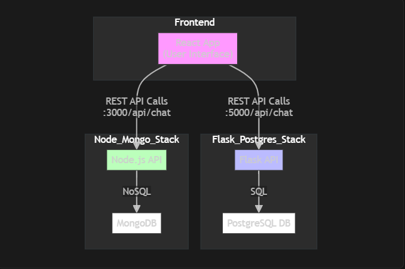
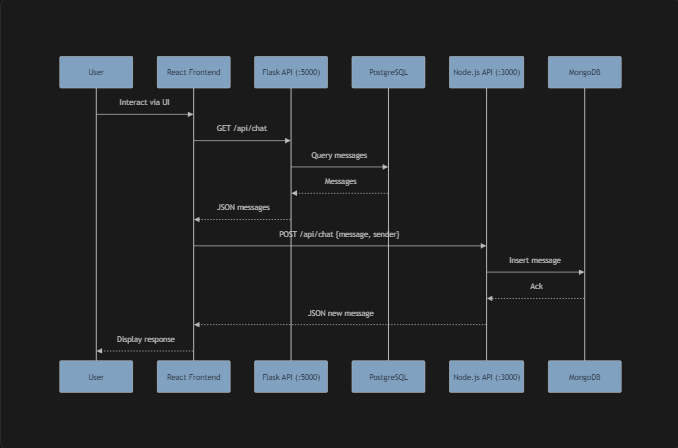

# Chatbot Scaling Stack Comparison

A comprehensive comparison of 2 technology stacks for building and scaling chatbot applications. This project demonstrates, benchmarks, and documents the performance and scalability of different backend and frontend stacks, providing practical insights for developers and architects.

## Table of Contents
- [Overview](#overview)
- [Project Structure](#project-structure)
- [Technology Stacks](#technology-stacks)
- [Setup & Usage](#setup--usage)
- [Stress Testing](#stress-testing)
- [License](#license)
- [Architecture Diagrams](#architecture-diagrams)
- [Example API Calls](#example-api-calls)

## Overview

Modern chatbots must handle high loads, low latency, and seamless scaling. This repository implements and compares two popular stacks:
- **Flask + PostgreSQL**
- **Node.js + MongoDB**

Each stack is containerized and includes a shared frontend. Stress testing scripts are provided to benchmark and compare real-world performance.

## Project Structure

- `flask-postgres-stack/` — Flask backend with PostgreSQL database
- `node-mongo-stack/` — Node.js backend with MongoDB database
- `frontend/` — React-based frontend for interacting with both backends
- `stress-testing/` — Load testing scripts (e.g., Locust)
- `deployment/` — Docker Compose and deployment configs

## Technology Stacks

### 1. Flask + PostgreSQL
- Python Flask REST API
- PostgreSQL for persistent storage
- Suitable for teams familiar with Python and relational databases

### 2. Node.js + MongoDB
- Node.js (Express) REST API
- MongoDB for flexible, scalable NoSQL storage
- Ideal for JavaScript-centric teams and rapid prototyping

### Frontend
- React single-page application
- Unified interface to test both backends

## Architecture Diagrams

### System Overview
<!--
flowchart TD
    subgraph Frontend
        FE["React App<br/>(User Interface)"]
    end
    subgraph Flask_Postgres_Stack
        FBE["Flask API"]
        PG["PostgreSQL DB"]
        FBE -- "SQL" -> PG
    end
    subgraph Node_Mongo_Stack
        NBE["Node.js API"]
        MG["MongoDB"]
        NBE -- "NoSQL" -> MG
    end
    FE -- "REST API Calls<br/>:5000/api/chat" -> FBE
    FE -- "REST API Calls<br/>:3000/api/chat" -> NBE
    style FE fill:#f9f,stroke:#333,stroke-width:2px
    style FBE fill:#bbf,stroke:#333,stroke-width:1px
    style NBE fill:#bfb,stroke:#333,stroke-width:1px
    style PG fill:#fff,stroke:#333,stroke-width:1px
    style MG fill:#fff,stroke:#333,stroke-width:1px
    classDef db fill:#fff,stroke:#333,stroke-width:1px;
-->


### Sequence Example
<!--
'''
sequenceDiagram
    participant User
    participant Frontend as React Frontend
    participant Flask as Flask API (:5000)
    participant Postgres as PostgreSQL
    participant Node as Node.js API (:3000)
    participant Mongo as MongoDB
    User->>Frontend: Interact via UI
    Frontend->>Flask: GET /api/chat
    Flask->>Postgres: Query messages
    Postgres->>Flask: Messages
    Flask->>Frontend: JSON messages
    Frontend->>Node: POST /api/chat {message, sender}
    Node->>Mongo: Insert message
    Mongo->>Node: Ack
    Node->>Frontend: JSON new message
    Frontend->>User: Display response
'''
-->


## Example API Calls

### Get All Messages

**Flask (Python) or Node.js (JavaScript) Backend**

- **Endpoint:** `GET /api/chat`
- **Response:**
```json
[
  {
    "id": 1,
    "message": "Hello!",
    "sender": "Alice",
    "timestamp": "2024-06-01T12:00:00.000Z"
  },
  ...
]
```

**cURL Example:**
```bash
curl http://localhost:5000/api/chat   # Flask
curl http://localhost:3000/api/chat   # Node.js
```

### Post a New Message

- **Endpoint:** `POST /api/chat`
- **Request Body:**
```json
{
  "message": "Hi there!",
  "sender": "Bob"
}
```
- **Response:**
```json
{
  "id": 2,
  "message": "Hi there!",
  "sender": "Bob",
  "timestamp": "2024-06-01T12:01:00.000Z"
}
```

**cURL Example:**
```bash
curl -X POST http://localhost:5000/api/chat \
  -H "Content-Type: application/json" \
  -d '{"message": "Hi there!", "sender": "Bob"}'

curl -X POST http://localhost:3000/api/chat \
  -H "Content-Type: application/json" \
  -d '{"message": "Hi there!", "sender": "Bob"}'
```

## Setup & Usage

### Prerequisites
- [Docker](https://www.docker.com/) and [Docker Compose](https://docs.docker.com/compose/)
- [Node.js](https://nodejs.org/) and [npm](https://www.npmjs.com/) (for frontend development)
- [Python 3](https://www.python.org/) (for Locust stress testing)

### Quick Start

1. **Clone the repository:**
   ```bash
   git clone https://github.com/ikigeng/Chatbot-Scaling-Stacks-Comparison.git
   cd Chatbot-Scaling-Stacks-Comparison
   ```
2. **Start all services with Docker Compose:**
   ```bash
   docker-compose up --build
   ```
3. **Access the frontend:**
   - Open [http://localhost:3000](http://localhost:3000) in your browser.
   - Switch between Flask and Node.js backends via the UI.

4. **Run stress tests:**
   - See `stress-testing/` for Locust scripts and instructions.

### Individual Stack Setup
- See the `README.md` in each stack's directory for manual setup and API documentation.

## Stress Testing

- Use Locust scripts in `stress-testing/` to simulate concurrent users and measure throughput, latency, and error rates.
- Compare results to evaluate which stack best fits your scaling needs.


## License

This project is licensed under the MIT License. See the [LICENSE](LICENSE) file for details. 